# CVE-2019-6988 & CVE-2023-39328

## 1.漏洞描述

CVE-2019-6988：

An issue was discovered in OpenJPEG 2.3.0. It allows remote attackers to cause a denial of service (attempted excessive memory allocation) in opj_calloc in openjp2/opj_malloc.c, when called from opj_tcd_init_tile in openjp2/tcd.c, as demonstrated by the 64-bit opj_decompress.

CVE-2023-39328：

A vulnerability was found in OpenJPEG similar to CVE-2019-6988. This flaw allows an attacker to bypass existing protections and cause an application crash through a maliciously crafted file.

存在问题的压缩解压缩套件： opj_compress，opj_decompress

CVE-2019-6988 的 poc：https://github.com/uclouvain/openjpeg/issues/1178

poc验证：但是该poc存在问题，文件头应该是损坏的

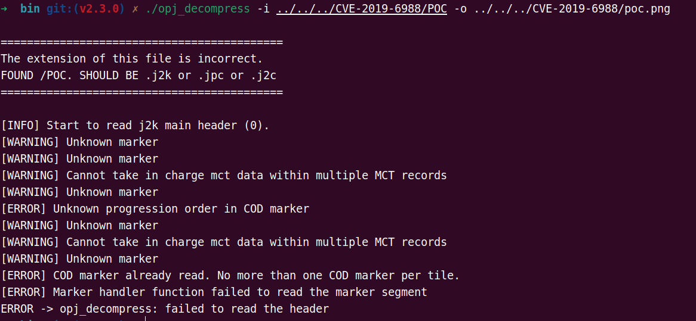

使用漏洞 CVE-2023-39328 的 poc：https://github.com/uclouvain/openjpeg/issues/1471，成功导致系统内存耗尽

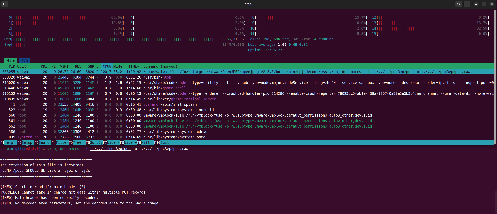

内存耗尽后系统将自动 killed 该进程

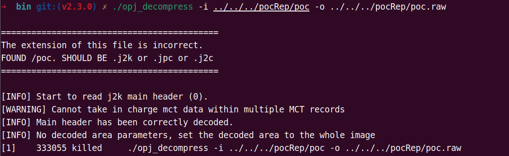

漏洞分析：

cve-2019-6988 的fix代码：

uclouvain/openjpeg项目中提交的修复（commit f3ee448815eb992b8d4746e32c05e8289f30415f）主要通过对J2K（JPEG 2000）编码参数中的SGcod、SPcod和SPcoc字段的所有参数值进行严格验证来解决问题

https://github.com/uclouvain/openjpeg/commit/f3ee448815eb992b8d4746e32c05e8289f30415f

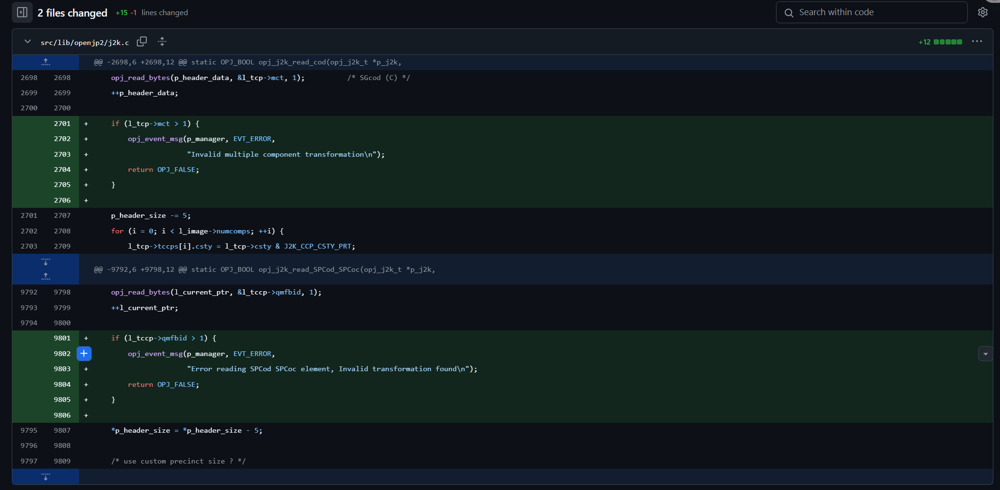

内存耗尽型漏洞：

gdb断点：`catch syscall exit_group`

查看退出前的堆栈调用：`bt`

漏洞调用链条总结：

* 入口点：main 函数调用 opj_decode 开始解码过程。
* 解码器调用：opj_decode 调用 opj_j2k_decode。
* 解码执行：opj_j2k_decode 调用 opj_j2k_exec，执行解码步骤。
* 瓦片解码：opj_j2k_exec 逐步调用解码过程中的函数，包括 opj_j2k_read_tile_header。
* 瓦片初始化：opj_j2k_read_tile_header 调用 opj_tcd_init_tile 初始化瓦片。
* 目标树创建：opj_tcd_init_tile 调用 opj_tgt_create 创建目标树结构。
* 内存分配：opj_tgt_create 调用 opj_calloc 分配内存。
* 漏洞触发：opj_calloc 计算总分配大小时，未对参数 nmemb 和 size 进行验证，导致攻击者可控制参数值，触发过度内存分配漏洞。

攻击者构造恶意的 JPEG 2000 图像文件，该文件在解压缩过程中会触发对 opj_tcd_init_tile 函数的调用，进而导致 opj_calloc 函数使用过大的参数值进行内存分配，使系统尝试分配过多的内存资源，最终因内存耗尽而崩溃或无法正常响应，造成拒绝服务

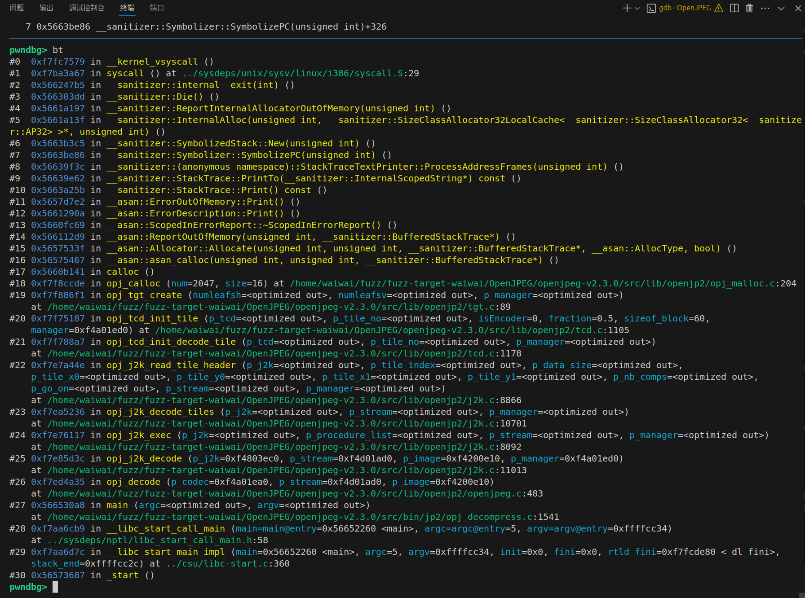

漏洞存在于 openjp2/opj_malloc.c 文件中的 opj_calloc 函数，当从 openjp2/tcd.c 文件中的 opj_tcd_init_tile 函数调用此函数时，会导致内存过度分配的问题

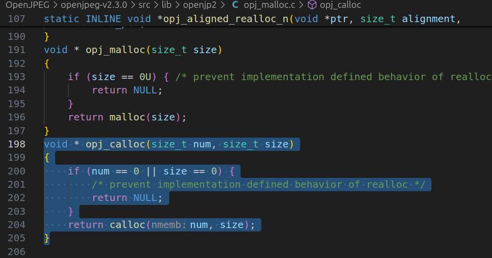

opj_calloc由opj_tgt_create函数调用，num和size分别是tree->numnodes，sizeof(opj_tgt_node_t)

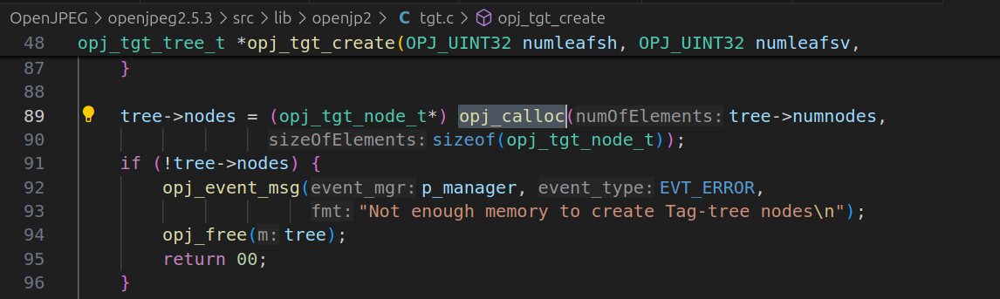

CVE-2023-39328的issue：https://github.com/uclouvain/openjpeg/issues/1471，该issue仍然处于open状态，暂时未修复

## 2.Fuzz

正常编译：

```shell
mkdir build
cd build
cmake .. -DCMAKE_BUILD_TYPE=Release
make
```

fuzz编译：使用debug模式，并且将套件编译为32位模式，方便asan

```shell
cmake .. -DCMAKE_BUILD_TYPE=Debug \
-DCMAKE_C_COMPILER=$HOME/tool/AFLplusplus/afl-clang-fast \
-DCMAKE_CXX_COMPILER=$HOME/tool/AFLplusplus/afl-clang-fast++  \
-DCMAKE_C_FLAGS="-fsanitize=address -g -m32" \
-DCMAKE_CXX_FLAGS="-fsanitize=address -g -m32"

make -j16
```

再次运行，asan检查出问题：

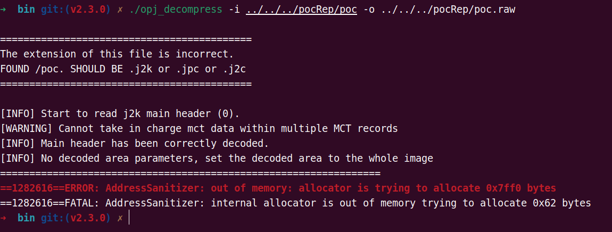

尝试fuzz：需要确保seeds中至少有一个可以正常运行的种子，并且需要确保种子不能太大，经过5个多小时，成功运行出13个crashes

```shell
afl-fuzz -i ./pocRep/poc-test -o ./fuzzoutput1 -m 0 -t 10000 -- /home/waiwai/fuzz/fuzz-target-waiwai/OpenJPEG/openjpeg-v2.3.0/build/bin/opj_decompress -i @@ -o test.raw
```

（由于子模块分支修改较为复杂，种子文件夹切换至v2.3.0-poc-test）

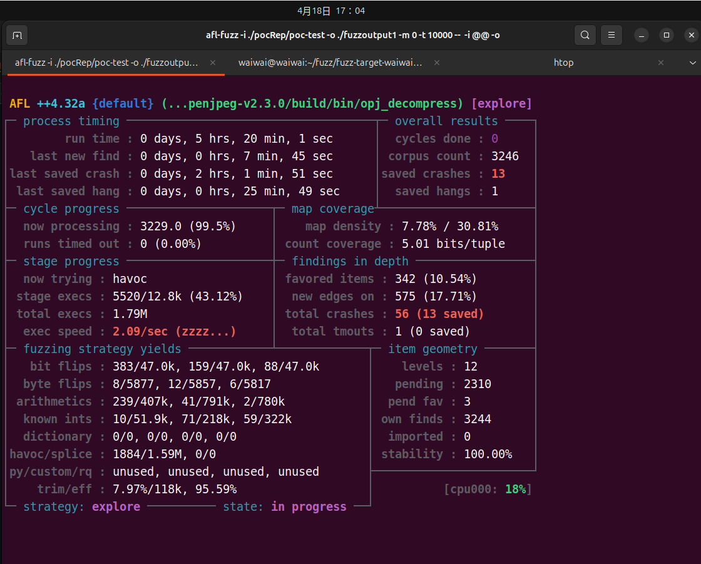

## 3.crash分析

直接对跑出来的crash输入目标程序，成功崩溃

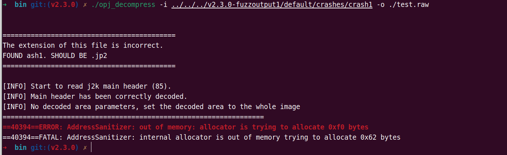

查看崩溃调用链条，可以看到与原poc的调用链条几乎完全一致，只是原poc最后调用的是calloc导致内存耗尽，而该crash则是最后调用的malloc导致内存耗尽，究其原因都是未对大小进行限制，所以该poc有效

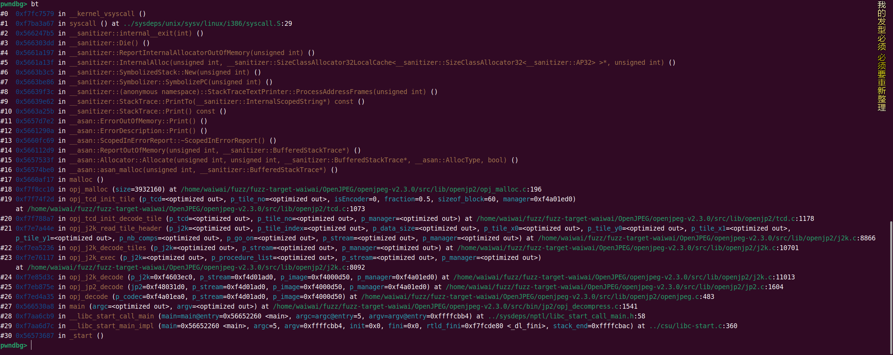
