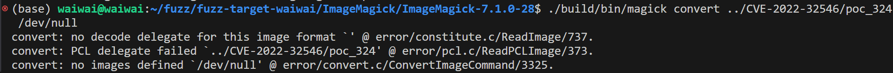

# CVE-2022-32546 & CVE-2023-34151

## 1.漏洞描述

CVE-2022-32546：

A vulnerability was found in ImageMagick, causing an outside the range of representable values of type 'unsigned long' at coders/pcl.c, when crafted or untrusted input is processed. This leads to a negative impact to application availability or other problems related to undefined behavior.

CVE-2023-34151：

A vulnerability was found in ImageMagick. This security flaw ouccers as an undefined behaviors of casting double to size\_t in svg, mvg and other coders (recurring bugs of CVE-2022-32546).

存在问题的套件：magic，其用于转换图像格式，并调整图像大小、进行模糊处理、裁剪、去斑、抖动、绘制、翻转、连接、重新采样等等

CVE-2022-32546 的 poc：https://github.com/ImageMagick/ImageMagick/files/8341428/poc_324.zip

poc验证：存在issue中的问题：



## 2.fuzz

正常编译：

```
./configure --prefix="/home/waiwai/fuzz/fuzz-target-waiwai/ImageMagick/ImageMagick-7.1.0-28/build/"
make -j16
sudo make install
```

fuzz编译：

```
export LLVM_CONFIG="llvm-config-14"

CC=$HOME/fuzz/AFLplusplus/afl-clang-fast \
CXX=$HOME/fuzz/AFLplusplus/afl-clang-fast++ \
C_FLAGS="-fsanitize=address,undefined -g" \
CXX_FLAGS="-fsanitize=address,undefined -g" \
./configure --prefix="/home/waiwai/fuzz/fuzz-target-waiwai/ImageMagick/ImageMagick-7.1.0-28/build"

make -j16
sudo make install
```

## 3.crash分析
