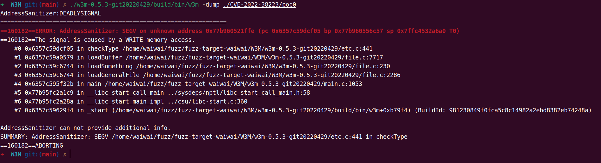
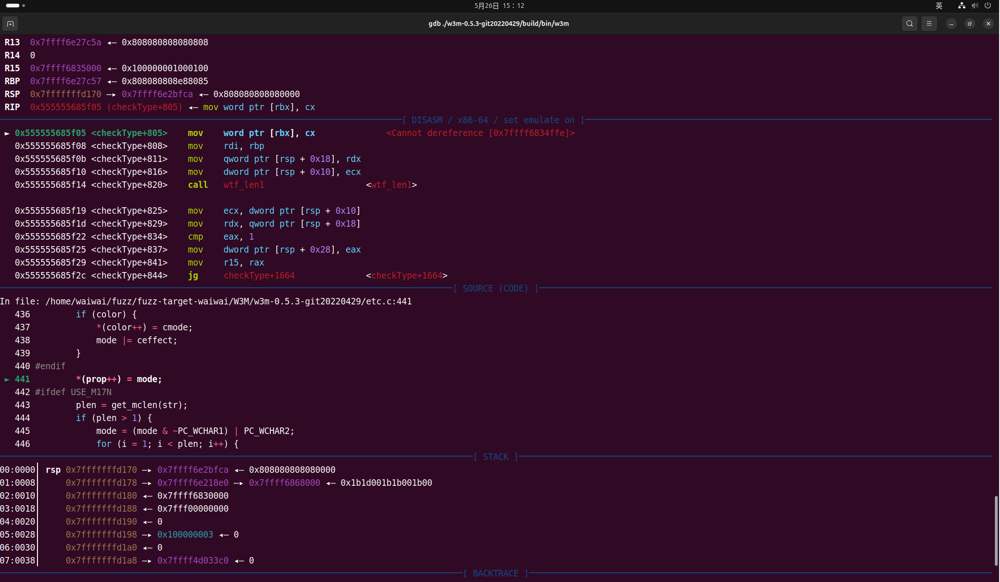
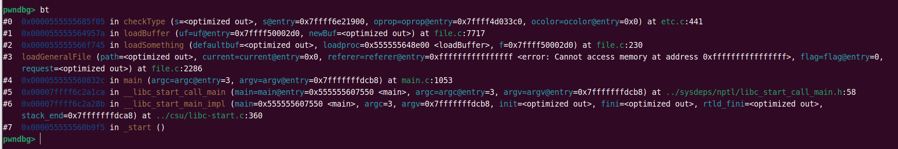
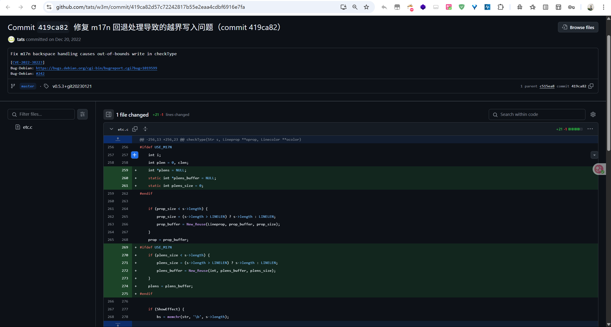
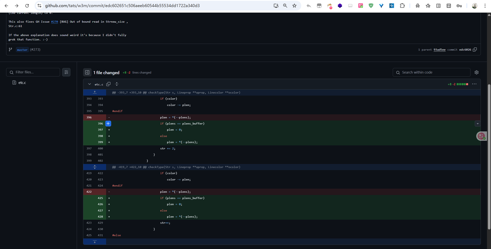
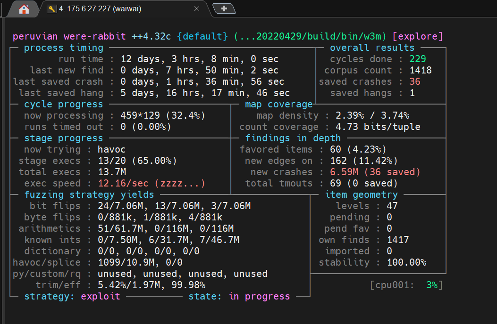
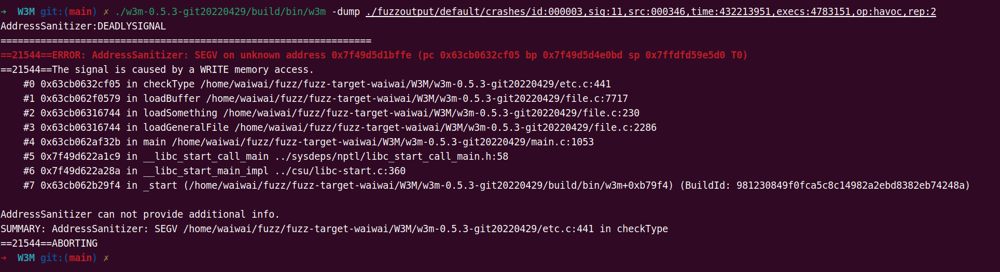
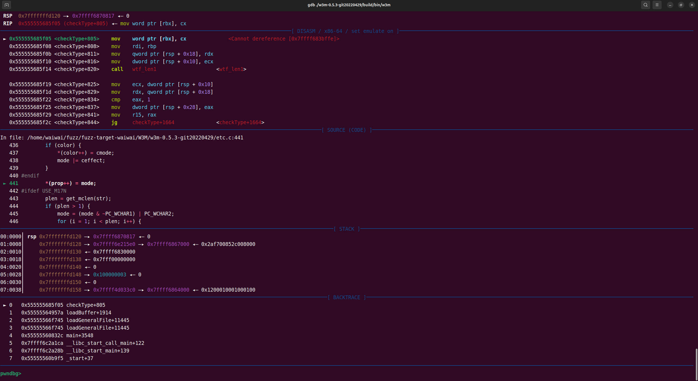

# CVE-2022-38223 & CVE-2023-4255

## 1.漏洞描述

CVE-2022-38223：There is an out-of-bounds write in checkType located in etc.c in w3m 0.5.3. It can be triggered by sending a crafted HTML file to the w3m binary. It allows an attacker to cause Denial of Service or possibly have unspecified other impact.  

CVE-2023-4255：An out-of-bounds write issue has been discovered in the backspace handling of the checkType() function in etc.c within the W3M application. This vulnerability is triggered by supplying a specially crafted HTML file to the w3m binary. Exploitation of this flaw could lead to application crashes, resulting in a denial of service condition.

CVE-2022-38223的poc：https://github.com/tats/w3m/issues/242

poc验证：



漏洞分析：

程序在 `etc.c`文件的第 441 行 `*(prop++) = mode;` 处收到 `SIGSEGV` 信号（段错误）

`mov word ptr [rbx], cx` 指令尝试将 `cx` 寄存器中的值（`0x1200`）写入 `rbx` 寄存器指向的内存地址，此时 `rbx` 的值是 `0x7ffff6834ffe`， GDB 提示 `Cannot dereference [0x7ffff6834ffe]`，表明该地址是无效的或不可写的内存区域，导致了段错误

也就是`checkType` 函数在处理输入数据并填充属性到 `prop` 指向的缓冲区时，`prop` 指针超出了缓冲区的合法边界，试图向一个无效的内存地址 `0x7ffff6834ffe` 写入数据，从而引发了段错误



调用栈：

- 崩溃发生在 `checkType` 函数中
- `checkType` 由 `loadBuffer` (file.c:7717) 调用
- `loadBuffer` 由 `loadSomething` (间接调用) 和 `loadGeneralFile` (file.c:2286) 调用
- 最终调用链追溯到 `main` 函数 (main.c:1053)。 这表明问题是在文件加载和内容类型检查的过程中发生的



patch代码：https://github.com/tats/w3m/commit/419ca82d57c72242817b55e2eaa4cdbf6916e7fa

由于checkType 负责分析输入缓冲区，并将属性写入 prop。当输入数据异常（如超长、多字节字符错误、边界条件），prop 可能在越界（例如输入的 n 为 0 或负，或输入长度不匹配）时被写入。由于没有检查 n，prop 可能为 NULL 或指向非法内存，写入 *(prop++) = mode; 导致段错误。

所以针对其修复增加边界检查：if (prop && n > 0) ...保证只有在 prop 有效且剩余空间大于 0 时才写入，防止越界写入和 NULL 指针写入。其他相关指针同理：对 color、多字节处理等分支也加强了边界检查，所有写操作均需保证目标数组存在空间。



CVE-2023-4255的patch代码：



补丁前存在的问题：
在第一次修复里，只是在写入前判断 n > 0，但没有在写入后减少 n。如果后续还有多次写入操作（如多字节字符、for 循环），n 没有减少，下一次写入时依然认为空间“充足”，实际上已经越界。
补丁后的变化：
每次写入 prop/color 后，立即 n--，保证剩余空间的正确性。多字节字符的循环中，每次都判断 n > 0 并及时递减，防止多次写入导致的越界。保证了prop/color 指针始终不会越界写入，完全杜绝了之前那种“首写安全，后续循环越界”的隐患。

总结：该补丁通过在每次写入属性或颜色后递减空间计数器 n，确保多字节字符等多次写入情况下不会发生缓冲区越界，彻底修复了上一补丁未覆盖的残留漏洞点


## 2.fuzz

正常编译：

```
sudo apt-get install libgc-dev
sudo apt install libgtk2.0-dev libgdk-pixbuf2.0-dev

export CC="gcc -fsanitize=address -g"
./configure --prefix="/home/waiwai/fuzz/fuzz-target-waiwai/W3M/w3m-0.5.3-git20220429/build/"
make -j16
sudo make install
```

fuzz编译并模糊测试：

```
CC=afl-clang-fast \
CXX=afl-clang-fast++ \
C_FLAGS="-fsanitize=address,undefined -g" \
CXX_FLAGS="-fsanitize=address,undefined -g" \
./configure --prefix="/home/waiwai/fuzz/fuzz-target-waiwai/W3M/w3m-0.5.3-git20220429/build/"

make -j16
sudo make install
afl-fuzz -i ./w3m -o ./fuzzoutput2 -C -- /src/fuzz1/w3m-0.5.3-git20220429/build/bin/w3m -dump @@
```

经过12天的crsh模式运行，成功运行出了36个crash：



## 3.crash分析

对crash按照编号顺序进行测试，该crash的成因与CVE-2022-38223的poc成因一致

相关漏洞原理已在上文阐述



